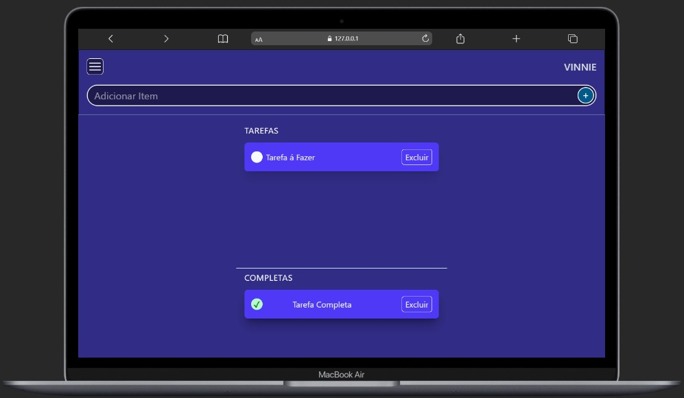
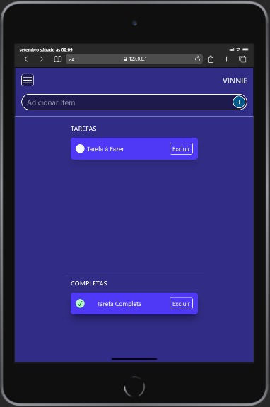
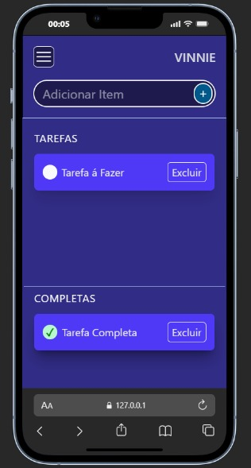

# Todo List v1.0

Aplicação web para gerenciamento de tarefas com interface responsiva.

## Funcionalidades
- Adicionar novas tarefas
- Marcar tarefas como completas
- Remover tarefas
- Separação visual entre ativas/completas

## Screenshots




## Tecnologias
- HTML5
- Tailwind CSS  
- JavaScript ES6

## Estrutura do projeto
todo-list/
├── index.html
├── assets/
│   ├── css/
│   │   ├── main.css
│   │   └── output.css
│   └── script/
│       └── script.js

## Como usar

### Pré-requisitos
- Node.js instalado
- Tailwind CSS configurado

### Instalação

1. Clone o repositório
```bash
    git clone https://github.com/ViniciusGCP94/todo-list.git
    cd todo-list
```
2. Instale as dependências
```bash
    npm install tailwindcss
```
3. Compile o Tailwind CSS
```bash
    npx tailwindcss -i ./assets/css/main.css -o ./assets/css/output.css --watch
```

4. Abra index.html no navegador
5. Digite uma tarefa e pressione Enter ou clique em +

## Como contribuir
1. Faça um fork do projeto
2. Crie uma branch para sua feature (git checkout -b feature/nova-funcionalidade)
3. Faça commit das suas mudanças (git commit -m 'Adiciona nova funcionalidade')
4. Push para a branch (git push origin feature/nova-funcionalidade)
5. Abra um Pull Request

## Roadmap

### v2.0 (Próxima versão)
- Refatoração com JavaScript moderno (ES6+)
- Implementação de módulos
- Melhoria na arquitetura do código

### v3.0
- Persistência de dados no localStorage
- Sistema de categorias
- Filtros avançados

### v4.0
- Migração para React
- Sistema completo de gerenciamento de projetos
- Interface desktop avançada

## Autor
### Vinicius Pereira

- GitHub: [@ViniciusGCP94](https://github.com/ViniciusGCP94)
- LinkedIn: [vinicius-gcp](https://linkedin.com/in/vinicius-gcp)
- Email: viniciusgcp94@gmail.com